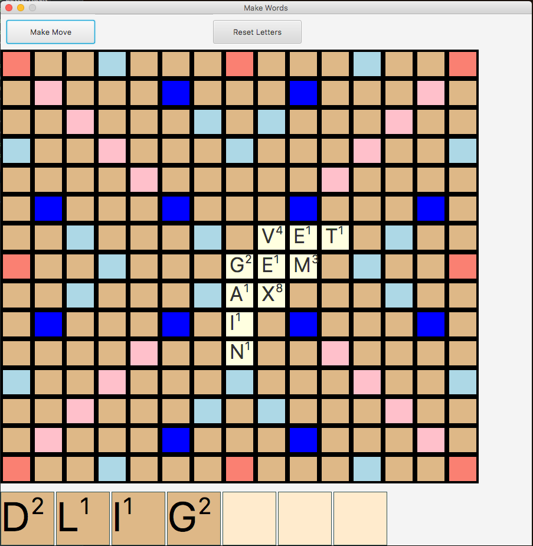

## What works

* Drag from rack to board to play tile
* Real set of (100) total letter tiles
* "Reset Letters" button to recall letters back to hand
* "Make Move" button to draw from the bag and switch to the other player's
  tile rack

## Todos

* Automated scoring
* Network play (matchups?)
* AI player (see [Norvig's post][nvp])

## In-game Screenshot

[nvp]: http://nbviewer.jupyter.org/url/norvig.com/ipython/Scrabble.ipynb
